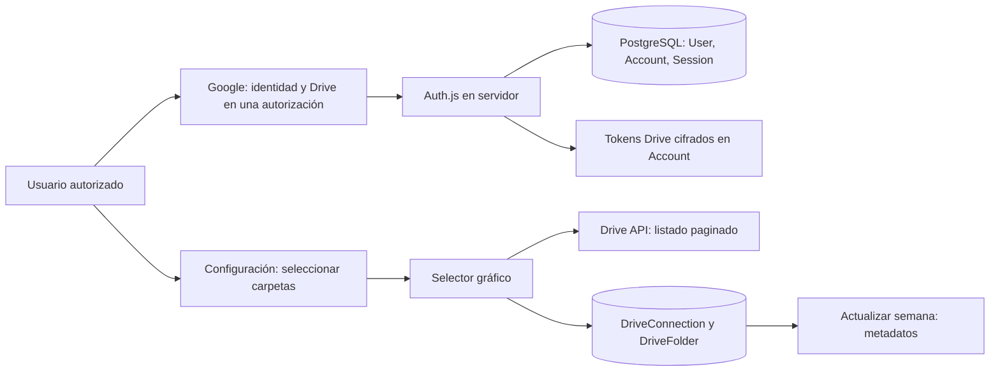

# Fase 2 · configurar y probar Google + Supabase

El código de autenticación, persistencia y exploración de Drive está implementado. No hay `.env.local` configurado: aún no se ha conectado una cuenta real ni aplicado la migración a Supabase. Sin variables, la plataforma muestra el acceso con el botón deshabilitado y bloquea las rutas privadas. No hay credenciales de demostración ni una sesión de prueba que permita saltar el login.

## 1. Tu proyecto Google existente

Reutiliza **Paradas Project** y el cliente web **Cliente web IMTES Recaudo - Dashboard1** mostrado en tus capturas. Conserva los orígenes y callbacks que necesita el desarrollo anterior.

1. Abre [Google Cloud Console](https://console.cloud.google.com/) y selecciona ese proyecto.
2. **APIs y servicios → Biblioteca → Google Drive API**: verifica que esté habilitada (ya indicaste que está lista).
3. **Google Auth Platform → Información de la marca**: completa nombre de app, correo de soporte y contacto si faltan. Nombre: **IMTES Recaudo 360**.
4. **Público → Usuarios de prueba**: conserva las cuentas que agregaste. Si agregas otra cuenta durante las pruebas, inclúyela también aquí.
5. **Acceso a los datos → Agregar o quitar permisos**: agrega `openid`, `https://www.googleapis.com/auth/userinfo.email`, `https://www.googleapis.com/auth/userinfo.profile`, `https://www.googleapis.com/auth/drive.readonly` y `https://www.googleapis.com/auth/drive.file`. Pulsa **Actualizar** y **Guardar**.
6. **Clientes → Cliente web IMTES Recaudo - Dashboard1**: conserva `http://localhost:3000` en **Orígenes autorizados de JavaScript**.
7. En **URIs de redireccionamiento autorizados**, conserva el callback de Google:

   - `http://localhost:3000/api/auth/callback/google` — acceso a la plataforma y autorización de Drive en un solo flujo.
   El callback anterior `/api/auth/callback/google-drive` ya no se utiliza; puede conservarse para no alterar tu configuración previa.

8. Pulsa **Guardar**. Copia el **ID de cliente** a `AUTH_GOOGLE_ID` en tu `.env.local`.
9. Copia el **Secreto del cliente** a `AUTH_GOOGLE_SECRET`. Si Google ya no permite verlo y no lo conservaste, **Add secret / Agregar secreto** permite generar otro: cópialo al crearlo. Conserva el anterior mientras el desarrollo anterior lo utilice. No lo pegues en el chat ni en Git.

Para Vercel, agrega el origen HTTPS estable y el callback de Google con ese dominio; configura `AUTH_URL` con esa misma URL. No uses comodines ni registres dominios desconocidos. Otro puerto local requiere el callback de Google para ese puerto. Los orígenes se conservan por compatibilidad; el intercambio OAuth de esta versión se realiza en el servidor.

Referencias: [cliente OAuth Google](https://developers.google.com/workspace/guides/create-credentials), [Google en Auth.js](https://authjs.dev/getting-started/providers/google).

## 2. Permisos y carpetas

Se conserva el esquema de permisos del desarrollo anterior: `drive.readonly` + `drive.file`. El login solicita identidad (`openid email profile`) y Drive en una sola autorización. Si se rechaza lectura de Drive, no se establece la conexión.

El explorador necesita consultar carpetas preexistentes y compartidas. Las operaciones de fuentes consultan exclusivamente el ID guardado para el usuario/tipo en la base de datos; el navegador no puede enviar otro ID para listar una fuente. El selector sí explora ubicaciones accesibles para elegir una carpeta. Los permisos de Google siguen determinando qué carpetas puede usar cada cuenta. La selección dentro de la plataforma no cambia las ACL de Drive ni comparte carpetas automáticamente.

`drive.file` se conserva para continuidad con la versión anterior y las próximas cargas. En esta fase no hay escrituras de archivos. `canAddChildren` comprueba si la cuenta puede agregar contenido en REPORTES; no demuestra por sí solo que el scope autorice futuras escrituras en toda carpeta preexistente. Esa prueba se realizará al implementar reportes. El usuario debe recibir permiso de editor en las carpetas donde vaya a cargar archivos.

Google clasifica `drive.readonly` como restringido. Revisa los requisitos de publicación externa antes de producción. En proyectos externos en pruebas, los refresh tokens de Drive pueden vencer a los siete días; reconectar renueva la autorización. Desconectar revoca el token y retira la cuenta Drive local; Google puede revocar otros permisos del mismo cliente/proyecto, incluyendo el uso por la versión anterior. Las carpetas elegidas se conservan y no se elimina ningún archivo.

Referencias: [scopes Drive](https://developers.google.com/workspace/drive/api/guides/api-specific-auth), [caducidad y revocación OAuth](https://developers.google.com/identity/protocols/oauth2).

## 3. Supabase PostgreSQL

1. Abre [Supabase Dashboard](https://supabase.com/dashboard). Crea un proyecto de desarrollo para esta plataforma, o usa uno existente dedicado a ella.
2. Guarda la contraseña de PostgreSQL y espera a que el proyecto esté listo.
3. Pulsa **Connect**. Copia la cadena **Transaction pooler** a `DATABASE_URL`. Usa **Session pooler** (puerto 5432) para `DIRECT_URL`, que Prisma utilizará para las migraciones. Una conexión directa también funciona si tu red admite IPv6 o el acceso IPv4 correspondiente.
4. Sustituye el marcador de contraseña por la real y codifica los caracteres especiales de la URL cuando corresponda. No uses la clave pública/anon de Supabase como contraseña PostgreSQL.
5. Usa una conexión server-side con el usuario `postgres` del proyecto o un rol apropiado con permisos sobre las tablas y `BYPASSRLS`. El navegador no se conecta a Supabase. No hay que configurar Supabase Auth: Auth.js gestiona las sesiones.
6. No crees las tablas a mano. La migración incluida crea `User`, `Account`, `Session`, `VerificationToken`, `DriveConnection` y `DriveFolder`. Habilita RLS sin políticas públicas en esas seis tablas para bloquear accesos desde la Data API. Puedes desactivar la Data API si el proyecto solo usa Prisma; no lo hagas en un proyecto compartido que ya dependa de ella.

Referencias: [Prisma en Supabase](https://supabase.com/docs/guides/database/prisma), [RLS](https://supabase.com/docs/guides/database/postgres/row-level-security).

## 4. Variables locales

Copia `.env.example` a `.env.local`, en la raíz del proyecto. Está excluido de Git.

| Variable | Contenido |
|---|---|
| AUTH_GOOGLE_ID | ID del cliente web existente |
| AUTH_GOOGLE_SECRET | Secreto del cliente Google |
| AUTH_SECRET | Clave aleatoria de la aplicación |
| AUTH_URL | `http://localhost:3000` |
| DATABASE_URL | Conexión PostgreSQL para ejecución |
| DIRECT_URL | Conexión PostgreSQL para migraciones |
| TOKEN_ENCRYPTION_KEY | 32 bytes aleatorios en base64 |
| AUTH_ALLOWED_EMAILS | Correos completos permitidos, separados por coma |

Genera **dos claves distintas** ejecutando `openssl rand -base64 32` dos veces en tu terminal: una para `AUTH_SECRET` y otra para `TOKEN_ENCRYPTION_KEY`. No las publiques. Conserva la clave de cifrado entre reinicios y despliegues; cambiarla sin una migración impide descifrar los tokens existentes. `STORAGE_BUCKET` queda vacío. Ninguna variable usa `NEXT_PUBLIC_`.

Los usuarios deben estar tanto en tu lista `AUTH_ALLOWED_EMAILS` como en los usuarios de prueba de Google mientras la app esté en pruebas. Vaciar la lista bloquea el login; retirarlos de ella también bloquea las acciones en sesiones existentes tras reiniciar o desplegar con la nueva lista.

## 5. Aplicar las tablas e iniciar

Desde la carpeta del proyecto:

```sh
npm ci
npm run db:migrate
npm run dev
```

`npm ci` genera Prisma Client con `postinstall`; `db:migrate` aplica la migración incluida. No se ha ejecutado contra tu base, porque faltan las cadenas reales. Para modificar el esquema en fases futuras se deben crear migraciones nuevas, sin editar una migración ya aplicada.

En Vercel coloca las mismas variables en el entorno correspondiente. Aplica la migración antes de habilitar el login. Build: `npm run build`. No se ejecutan migraciones automáticamente durante el build.

## 6. Probar el login y las carpetas

1. Visita `http://localhost:3000/dashboard` sin sesión: debe enviarte a `/acceso`.
2. Pulsa **Continuar con Google**, elige una cuenta autorizada y confirma: regresa a `/dashboard`. El header debe mostrar tu identidad y **Salir**.
3. Abre **Configuración**: Drive ya debe estar conectado con el mismo login. Si tu sesión es anterior al cambio, vuelve a entrar o usa Conectar Google Drive una vez para otorgar los permisos nuevos. Renovar autorización queda para recuperar una conexión vencida o desconectada.
4. En cada fuente (OXXO, CAUS, VALIDACIONES, CREDENCIALIZACION y REPORTES), pulsa **Seleccionar carpeta**. Elige **Mi Drive**, **Compartido conmigo** o **Unidades compartidas**. La flecha abre una carpeta; el nombre la selecciona. Usa el breadcrumb o la flecha de regreso para subir.
5. Selecciona y pulsa **Guardar carpeta**. Los archivos normales no se pueden seleccionar como carpetas. Los accesos directos a carpetas muestran su condición y se resuelven al guardar.
6. Recarga Configuración: cada carpeta se valida por separado. **Cambiar carpeta** permite sustituirla. REPORTES solo guarda la ubicación base; no crea carpetas anuales ni reportes.
7. Abre **Actualizar semana → Explorar carpeta de Google Drive** en cada fuente. Solo se muestran nombre, tipo, tamaño y modificación, con **Cargar más** cuando hay otra página. Una página sin archivos compatibles puede tener páginas posteriores.
8. Pulsa **Salir**, entra de nuevo y comprueba las carpetas; reinicia el servidor para verificar persistencia. La sesión dura hasta ocho horas en la base; Drive puede tener otro vencimiento.
9. Prueba una carpeta compartida y un acceso directo; retira acceso a una carpeta y elimina otra carpeta de prueba. Solo esa fuente debe marcar un problema. Google puede responder 404 tanto por eliminación como por falta de acceso, por eso se informa “No encontrada o sin acceso”.
10. Prueba REPORTES con una cuenta que solo tenga lectura: debe advertir que no puede agregar archivos. Prueba **Desconectar**: quedan las preferencias, se retiran los tokens locales y el explorador deja de funcionar. Si Google no confirma revocación, aparece una advertencia para revisar las conexiones de la cuenta.

No se procesa contenido ni se cargan archivos a Drive en esta fase. Las metas siguen siendo ajustes locales de la interfaz.

## Flujo y esquema



Una `DriveConnection` por usuario. Una `DriveFolder` por usuario/tipo, con `folderId` como ID real de destino, `shortcutId` opcional, nombre visible, resource key, configuración, última validación, estado y permiso de agregar contenido. `Account` almacena los tokens OAuth cifrados con AES-256-GCM; `Session` mantiene sesiones persistentes. La sesión enviada al navegador solo contiene identidad y vencimiento.

Consulta [VERIFICACION-FASE2.md](VERIFICACION-FASE2.md) para separar verificaciones locales y pruebas reales pendientes.

El login unificado solicita consentimiento explícito (`prompt=consent`) para que Google entregue el token de renovación, incluso si ya se usó este cliente en la versión anterior. El consentimiento forma parte del mismo login.
